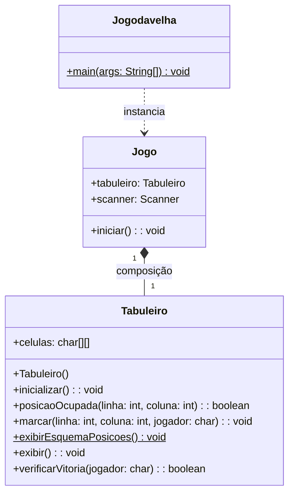

```mermaid
classDiagram
    class Jogodavelha {
        +main(args: String[])$ void
    }

    class Jogo {
        +tabuleiro: Tabuleiro
        +scanner: Scanner
        +iniciar(): void
    }

    class Tabuleiro {
        +celulas: char[][]
        +Tabuleiro()
        +inicializar(): void
        +posicaoOcupada(linha: int, coluna: int): boolean
        +marcar(linha: int, coluna: int, jogador: char): void
        +exibirEsquemaPosicoes()$ void
        +exibir(): void
        +verificarVitoria(jogador: char): boolean
    }

    Jogodavelha ..> Jogo : instancia
    Jogo "1" *-- "1" Tabuleiro : composição
```
